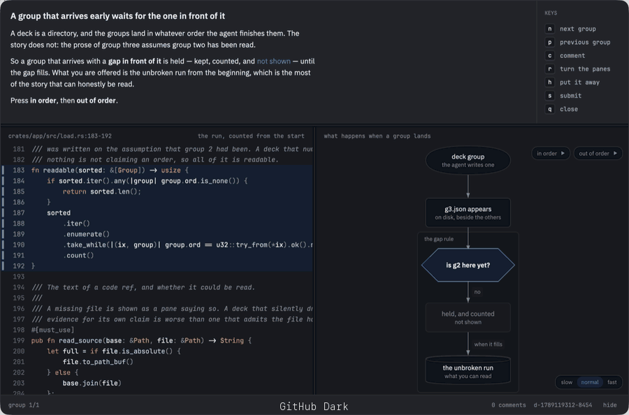

<div align="center">

<picture>
  <source media="(prefers-color-scheme: dark)" srcset="assets/mark-dark.svg">
  <source media="(prefers-color-scheme: light)" srcset="assets/mark-light.svg">
  
</picture>

<h1>deck</h1>

[](https://github.com/henit-chobisa/deck/actions/workflows/build.yml)
[](https://github.com/henit-chobisa/deck/actions/workflows/test.yml)
[](https://github.com/henit-chobisa/deck/releases)
[](LICENSE)

A presentation surface for agents, written in Rust.

</div>


<!--
  The hero goes here, and it is the most important thing on this page: a reader
  learns what deck is from the picture faster than from any paragraph on it.

  What belongs here is a deck OPEN — two panes of code with the narration band
  above them, around 1600 wide. Drop it at assets/deck.png and uncomment:


<p align="center"><i>An agent points at the lines it means. You walk them, comment, and submit.</i></p>
-->

<div align="center">

[Why](#why) • [How it works](#how-it-works) • [Demo](#demo) • [Install](#install) • [In the window](#in-the-window) • [Live](#going-live) • [Diagrams](#diagrams) • [Theming](#theming)

</div>

## Why

Your agent finishes a change and writes you a paragraph. It names four files and
six line numbers. Now you open each one, find the line, hold the argument in your
head while you go and look at the next one, and try to remember what the third
one was for. By the time you have the whole picture you have done the work of
assembling it yourself — which is the work you asked for. Then you type *looks
good*, and neither of you is quite sure what you approved.

Now another one. Say you ask the agent to explain something to you, or a plan —
maybe it tells you the limitations, maybe it tells you where the architecture is
broken. But the problem is that it **tells** you. It never **shows** you. And
then you are too tired to read all of that, so you say "do what's good and move
on".

My favourite: code reviews. A PR comes to you, you ask the agent to review it,
and it gives you five paragraphs in a language you understand fifty per cent of.
Now you are too tired to go and sniff into the code — and the PR is 20,000 lines
to sniff into, by the way. No architecture was explained. No root context was
given. There are only two outcomes. Either you become a proxy, "okay", and get
an alert at three in the morning. Or you discard the review and dig in yourself,
coffee in hand, 20,000 lines, rewriting everything you thought you knew.

Explanation as *text* is the bottleneck now. People run four, six, eight agents
at once, and their own reading speed is the ceiling — the agents finish and then
wait on a human reading prose. Deck is built for that moment. It is not a diff
viewer and not a chat window: it is the surface where an agent makes an argument
about code, draws the flow it is describing, and a person answers it in the
fewest keystrokes that can carry the answer.

## How it works

Four commands and a wait. No daemon, no editor plugin, no protocol to speak —
which is why it works the same with **Claude Code, Codex, Cursor and Amp**, or
whatever comes next. A deck is a review, a walkthrough, a plan, or an
explanation — whatever an agent would otherwise have written as prose.

```sh
deck new --title "The batch counter stalls at 63" --total 2
# prints the deck's path

deck open <path>          # a bar appears; you open it when you are ready

deck group <path> \
  --say "The counter is decremented on the **error path** too." \
  --ref "src/batch.ts:140-148 decremented *twice* when the write fails" \
  --ref "src/queue.ts:88 the only caller"

deck seal <path>
deck wait <path>          # blocks until you submit, prints the review as JSON
```

Most of the time you will not run any of this. `deck setup` installs a skill into
your agents and they reach for it on their own.

## Demo


https://github.com/user-attachments/assets/ea4f8fe3-50b2-4412-917c-882b536a538a


<!--
  Drop the video in here.

  GitHub will not play a video committed to the repo. The way that works is to
  open this file in the web editor, drag the file into the text area, and let
  GitHub upload it — it inserts a user-attachments URL that renders as a player.
  MP4 or MOV, under 10 MB.

  Then delete this comment and write a sentence under it saying what is on
  screen. A silent video with no caption makes the reader work out what they
  are watching, which is the thing this whole page is against.
-->

## Install

**macOS and Linux**

```sh
brew install henit-chobisa/deck/deck
```

**Windows, and anywhere with a Rust toolchain**

```sh
cargo install --git https://github.com/henit-chobisa/deck deck-app
```

Then once, to choose how deck looks and to tell your agents it exists:

```sh
deck setup
```

Both install from source — deck compiles nineteen tree-sitter grammars into the
binary, so the first build takes a few minutes. It is also why neither platform
asks about an unsigned binary: nothing was downloaded, so there is nothing for
Gatekeeper or SmartScreen to hold.

On Windows this needs the MSVC toolchain — Visual Studio Build Tools with the
"Desktop development with C++" workload — for the linker.

## The catch

`deck setup` installs a skill telling your agents when to build a deck. A skill
is a suggestion, and an agent that has just finished an investigation has
enormous momentum toward typing out what it found. Suggestions lose to that
often enough that you can install deck and then go a week without seeing one.

So setup also offers to turn on the catch. It reads each finished reply, and
when one names two or more `file:line` locations it sends the reply back and
says to build the deck instead — while the agent is still mid-turn and still
holding everything it just learned.

```
That reply names 3 code locations (view.rs:1109, protocol.rs:253,
protocol.rs:155). Locations in prose are the thing deck exists to
replace — the reader has to go and open each one and hold the
argument together themselves.
```

Two locations, not one: a single pointer is a sentence, and opening a window for
it would be ceremony. Two is an argument, and assembling it is the work deck
does for you.

It stays quiet whenever it might be wrong — a deck already built this turn, a
reply about deck itself, the same location cited twice, a version number or a
time of day that only looks like a citation. A hook that fires when it should
not is worse than one that never fires, because you turn it off.

Claude Code only, for now; it is the one agent with a hook that fires on the
reply itself. Say no at the prompt and everything else still works. Turn it on
later with `deck setup`, or take the `Stop` entry out of
`~/.claude/settings.json` to turn it off.

## In the window

### Walk the argument, not the diff

A deck is a sequence of groups, and each group is one thing the agent is saying
with the code that shows it. `n` and `p` move between them. The panes are the
evidence for that one claim — an enum and the column that stores it, a writer and
the reader that consumes it — so the relationship is on screen rather than in
your head.

<!--
  A screenshot here: a group open, both panes lit, the narration above them.
  Caption it with what the two panes have to do with each other — that is the
  thing a still picture cannot say on its own.
-->

### Comment where you disagree

Drag across lines and press `c`. Drag across the narration itself to answer a
sentence rather than a line, which is where *this whole approach is wrong* goes.
`⌘↩` saves, `esc` discards. Every comment goes back at once, pinned to the lines
it was about, with the text it was written against — so it survives the file
moving underneath it.

### Put it away without losing it

A deck arrives as a bar at the bottom of the screen, not a window across the
middle of your work. Open it when you are ready; press `h` and it goes back to
the bar with your comments still in it. The agent cannot open the deck itself,
and there is no flag that lets it.

### Read with the lights off

`z` puts a shade over every display and leaves the deck on top of it, blurred
and dimmed, so the only lit thing on screen is the thing you are reading. Press
it again, or click the dark, to bring the lights up. It goes by itself when the
deck does.

```toml
# ~/.deck/config.toml
[zen]
dim = 0.72   # how far the rest of the screen goes down
blur = true  # and whether it is blurred as well as darkened
```

### Arrange it the way you read

Drag a seam to resize a pane, `r` to turn the panes a quarter, and the shape is
remembered for next time.

| key | does |
| --- | --- |
| `n` `p` | next / previous group |
| `c` | comment on the selection, or on the group |
| `r` | turn the panes |
| `z` | lights off |
| `h` | put the deck away |
| `s` | submit the review |
| `q` | close without answering |

## How do you know the agent did not make it up

You do not have to take its word for the half that can be checked. `deck group`
opens every file a ref points at, and refuses the group if the file is not there
or the range runs past the end of it — so a deck cannot be written against code
that does not exist, and the agent is told while it is still running and can go
and look.

That leaves the other half: whether the *claim* about those lines is true. Deck's
answer is that you are looking at the lines while you read the claim, which is
the whole shape of the thing. A summary in chat asks you to believe it. A deck
puts the evidence next to the argument and gives you a key to disagree on.

And when the file moves underneath you, comments come back with how far to trust
them — `diff`, `fingerprint`, or `stale` — rather than a line number that may
have drifted.

## Going live

`l` puts the deck into a walkthrough. The room rearranges around the same deck —
the rail slides in beside the panes carrying everything that has been said, the
voice picks up the current group, and the agent that wrote the deck can move
your eyes while it talks. `l` again puts it all back.

Three keys answer, and they cost one keystroke each:

```
1   noted
2   wait, what?
3   that's wrong
```

Tapping one leaves a reaction pinned to whatever is on screen — no typing, no
composer, nothing to close. `c` is still there when you have actual words, and
while the composer is open those same three keys set what the comment is asking
for instead of leaving a bare reaction.

This is what `Kind` in the protocol has always been for. Every comment used to
go back marked `question` whatever you meant, which left the agent guessing your
tone from your prose.

### What the agent can do while you watch

```sh
deck show <deck> --ref "src/view.rs:106-110"   # move my eyes here
deck say  <deck> --text "…"                    # say something, spoken if you have a voice
deck next <deck> --after <cursor>              # block until the reader does something
```

All shell commands, so this works the same with Claude Code, Codex, Cursor and
Amp — the same reason the other verbs do. `deck next` returns a cursor, so an
agent that was busy or restarting reads from where it got to rather than losing
what you pressed while it was away.

Movement is yours the moment you take it. Scroll, select, or start typing and
the agent stops moving you; the rail says **paused** while that holds. It lapses
on its own after a few seconds of stillness, and `f` takes it back immediately.
A composer holds it until you close it, because nobody should have the ground
moved while they are writing about it.

### What comes back

`deck wait` returns the comments as always, and for a walked deck it also
returns a `transcript`: what you were shown, in what order, and what you said
about each part. Not that a review happened — **what the reviewer actually
looked at.**

### The voice

Reading aloud is optional and off in one line. It is also not deck's to choose a
provider for:

```toml
[speech]
aloud   = true
engine  = "system"     # or "command"
rate    = 158
pause   = 420

# engine = "command" — anything that reads text on stdin and plays it.
# Kokoro, Piper, an ElevenLabs or Fish Audio script, whatever ships next.
command = "kokoro-cli --voice af_heart -"
```

`system` uses whatever the machine already has and needs no setup — macOS
through `say`, Linux through `spd-say`. Windows has no system synthesiser to
pipe into, so `engine = "command"` is the answer there.

On macOS the voices installed by default are the compact ones and they sound
like it. The neural ones are a free download:

```
System Settings → Accessibility → Read & Speak → System Voice
  → Manage Voices… → English → anything marked Premium
```

On macOS 15 and earlier that pane is called Spoken Content. Then `deck setup`
offers it by name. Nothing is uploaded for `system` or for any command you run
locally — a narration describes code that has not shipped, and where it goes is
your call, not deck's.

## Diagrams

Some things are in no file at all — how a click reaches a controller, the order
four services touch one request. A group can carry a picture beside its code, and
the picture can be walked.

```json
{
  "title": "what a Run click does",
  "nodes": [
    { "id": "run", "label": "Run", "role": "actor" },
    { "id": "q", "label": "another job in progress?", "role": "decision" },
    { "id": "queued", "label": "status QUEUED, no task" }
  ],
  "edges": [{ "from": "run", "to": "q" }, { "from": "q", "to": "queued", "label": "yes" }],
  "flows": [
    { "name": "where it stalls", "color": "#d29922", "steps": ["run", "q", "queued"] }
  ]
}
```

A **flow** is a named path through the picture. Press it and a current travels
the route while the rest of the diagram recedes — several to a picture, so the
happy path and the one that stalls can share the same seven boxes. Drag the
drawing anywhere; hold `⌘` or `ctrl` and scroll, or pinch, to zoom.

<!--
  A GIF still wanted here: a flow playing, with the rest of the diagram receding. This one
  has to move — the travelling is the whole point and a still frame of it is
  just a diagram with some boxes a different colour.
-->

There are no colours, sizes or positions in the format, on purpose. A node says
what it *is* and how much it matters, and deck owns every pixel — so two decks
drawing the same idea come out looking the same.

## Theming

Deck borrows your editor's colours rather than shipping a look you have to
tolerate beside your work.



<i>One deck, twenty themes, nothing changed but the config line. The page, the
text, the accent and the syntax come from the editor; the shapes and the spacing
are always deck's.</i>

```toml
# ~/.deck/config.toml
[theme]
editor = "vscode"   # nvim | zed | vscode | cursor | windsurf
```

It takes the page, the text, an accent, and whatever syntax colours the theme
has. Never its chrome — a theme designs its own status bar and tab strip, and
those are answers to questions deck is not asking. To try one on without changing
your editor:

```sh
deck open <path> --theme "vscode:Solarized Dark"
```

## A deck is a directory

That shape does something: the agent writes the header, then a group at a time,
then `done`. You can start reading group one while group four is still being
written.

```
d-1788265010-8842.deck/
  deck.json      the header — title, project, how many groups are coming
  g1.json        one claim, and the code that shows it
  g2.json
  done           written last
d-1788265010-8842.review    your answer, written beside it
```

[`PROTOCOL.md`](PROTOCOL.md) is the full specification, frozen at version 1, and
[`docs/how-it-works.md`](docs/how-it-works.md) is the shape of the rest.

## Contributing

```sh
cargo test --workspace
```

- [CONTRIBUTING.md](CONTRIBUTING.md) — conventions, and what needs doing
- [docs/how-it-works.md](docs/how-it-works.md) — the architecture
- [PROTOCOL.md](PROTOCOL.md) — the wire format, frozen at v1
- [AGENTS.md](AGENTS.md) — the same, for an agent changing this repo

Deck is used by the people writing it, and nearly every fix so far has come from
somebody hitting something while reading a deck of their own.

## License

Apache-2.0. See [LICENSE](LICENSE).
