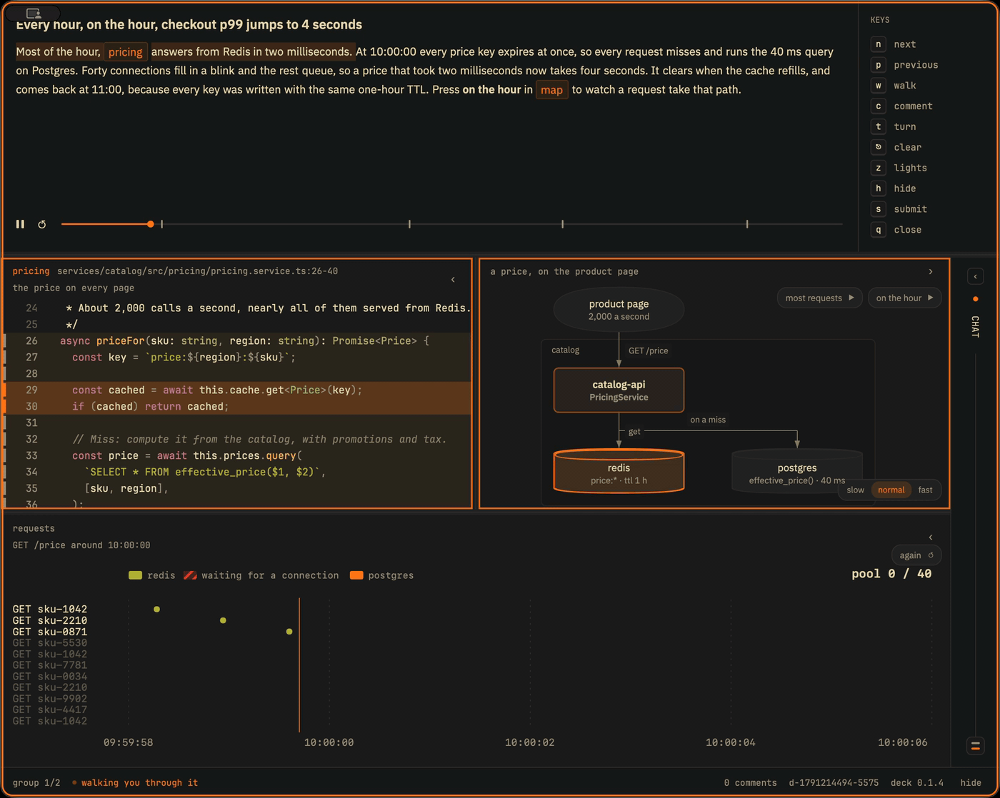
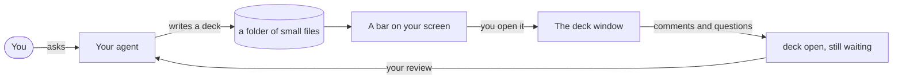

<div align="center">

<picture>
  <source media="(prefers-color-scheme: dark)" srcset="assets/mark-dark.svg">
  <source media="(prefers-color-scheme: light)" srcset="assets/mark-light.svg">
  
</picture>

<h1>deck</h1>

[](https://github.com/henit-chobisa/deck/actions/workflows/build.yml)
[](https://github.com/henit-chobisa/deck/actions/workflows/test.yml)
[](https://github.com/henit-chobisa/deck/releases)
[](LICENSE)

Focused on engineers, built for agents.

</div>

<p align="center">

</p>

<p align="center"><i>An agent leverages deck to walk you through intent, one claim at a time, until the whole decision is yours. Argue, decide and lock.</i></p>

<div align="center">

[Why](#why) • [Install](#install) • [Where deck helps](#where-deck-helps) • [How it works](#how-it-works) • [In the window](#in-the-window) • [Docs](#docs)

</div>

## Why

Agents read and write code faster than any of us can follow. We cannot keep up,
so we give our understanding up, one *looks good* at a time, and in a team
building seven things at once, soon nobody knows what is happening behind the
scenes.

So instead of building another harness for agents, deck is **focused on
engineers, but built for agents**. The agent does the explaining, and you keep
the understanding.

You have seen the problem. Your agent finishes a change and writes you a
paragraph that names four files and six line numbers. You open each one and hold
the argument in your head, and by the time you have the whole picture you have
done the assembling yourself. Then you type *looks good*, and neither of you is
quite sure what you approved.

My favourite is code review. The PR is 20,000 lines, and the agent's review is
five paragraphs in a language you understand fifty per cent of, with no root
context. Either you become a proxy, say "okay", and get an alert at three in the
morning, or you discard the review and dig in yourself, coffee in hand,
rewriting everything you thought you knew.

## Install

Run one script. It downloads deck for your machine, checks that the download is
intact, and puts it on your PATH. Then it runs `deck setup`, which asks you a few
questions.

On macOS or Linux, run this in a terminal:

```sh
curl -fsSL https://raw.githubusercontent.com/henit-chobisa/deck/main/install | sh
```

On Windows, run this in PowerShell:

```powershell
irm https://raw.githubusercontent.com/henit-chobisa/deck/main/install | iex
```

Run it as yourself, not with `sudo`. Your settings and decks are kept if you run
it again. Deck updates itself on macOS and Linux; on Windows, run `deck upgrade`
when you want the next release.

<details>
<summary>Build it from source instead</summary>

You need Rust. On Linux you also need WebKitGTK, which the window uses to draw
pages.

```sh
cargo install --git https://github.com/henit-chobisa/deck deck-app
deck setup
```

</details>

## Where deck helps

### Debugging a race condition: the books don't balance

Say finance tells you the ledger is $80 short, and every line of the withdrawal
code looks right. You ask your agent why.

In the recording below, the agent puts the withdrawal code beside a timeline of
two $80 cash-outs landing on a $100 wallet, milliseconds apart. As each sentence
is read, the line it describes lights up and the timeline moves forward, until
both cash-outs are paid and $80 is missing. The second group shows the fix and
replays the same moment.


### Planning with your agent: decide before a line is written

Say checkout is slow because it renders the receipt while the customer waits,
and your agent wants to move that work to a queue. Before it writes any code,
you ask it to show you the plan.

Below, the agent shows today's checkout code beside the change it would make,
and a chart of what the change buys: the p99 falls from 4.2 seconds to 260
milliseconds. Then it shows the cost. On Black Friday the queue backs up, and
receipts arrive nine minutes late. You decide with both numbers in front of you.


### Learning a system you didn't build: one query, end to end

Say you have just joined the team that owns search, and the person who built it
has left. You ask your agent to walk you through it.

Below, the agent follows one real query, *red running shoes under $80*, from the
search box to the results: a map of the service, the code at each stop, and the
query being taken apart into filters and terms. When you ask why popularity
counts for 30 per cent, the answer comes back inside the deck, with a chart of
the experiment that chose the number.


### Reviewing a 20,000-line PR: chapters, agreed first

Say a teammate's branch changes 20,000 lines across payments, the ledger and the
dashboard, and you have to approve it. You ask your agent to review it.

Below, the agent reads the branch and proposes the review as three chapters, one
for each layer the branch was built in, and asks before it starts. Chapter one
opens as a deck: a map of the branch, the new middleware beside a timeline of a
retried payment, and the test, with what the test does not prove. Your review of
chapter one shapes chapter two.


## How it works

You install deck once, and after that your agent does the work. It works the
same way with Claude Code, Codex, Cursor and Amp, because all an agent needs is
a shell.

1. **You run `deck setup`.** It asks how deck should look, and can borrow your
   editor's theme. It installs a short skill into each agent it finds, so they
   know when to reach for deck. And it offers to turn on [the
   catch](docs/the-catch.md), which sends a reply full of `file:line` locations
   back to the agent to become a deck.
2. **You ask your agent about some code.** A bug, a plan, or a review.
3. **The agent writes a deck.** A deck is a folder of small files: a title, then
   one group at a time. Each group is one thing the agent wants to say, and the
   code that shows it. Deck refuses a group that points at a file or a line that
   does not exist.
4. **A bar appears at the bottom of your screen.** You open it when you are
   ready. The agent cannot open it for you.
5. **You walk through it.** Each sentence lights the code it is about. Press `w`
   to have it read aloud.
6. **You answer.** Select lines and press `c` to comment. **Ask now** sends the
   question straight away; **Add to review** keeps it until you submit.
7. **The agent gets your answer.** The command that opened the deck is still
   waiting. When you submit, ask, or close the deck, it ends and hands the agent
   what you said, pinned to the lines you said it about.


```mermaid
flowchart LR
  you([You]) -- asks --> agent[Your agent]
  agent -- "writes a deck" --> folder[("a folder of small files")]
  folder --> bar[A bar on your screen]
  bar -- "you open it" --> window[The deck window]
  window -- "comments and questions" --> waiting["deck open, still waiting"]
  waiting -- "your review" --> agent
```

<details>
<summary>What the agent runs</summary>

Four commands. Most of the time you will never type them; the skill tells your
agent when and how.

```sh
deck new --title "The batch counter stalls at 63" --total 2   # prints the deck's path
deck open <path>                                               # the bar, and the wait
deck group <path> --say "The counter is decremented on the **error path** too." \
  --ref "src/batch.ts:140-148 decremented *twice* when the write fails"
deck seal <path>                                               # no more groups
```

</details>

<details>
<summary>Why the waiting command is the one that ends</summary>

An agent is woken by a process ending, so whatever wakes it has to be something
that can end. The window cannot: somebody asking a question still wants the deck
in front of them. So the window runs as a process of its own, and `deck open`,
the command the agent ran, is the one that ends with your answer.

</details>

<details>
<summary>A deck on disk</summary>

```
d-1788265010-8842.deck/
  deck.json      the header: title, project, how many groups are coming
  g1.json        one claim, and the code that shows it
  g2.json
  done           written last
d-1788265010-8842.review    your answer, written beside it
```

You can start reading group one while group four is still being written.
[`PROTOCOL.md`](PROTOCOL.md) is the full specification, frozen at version 1.

</details>

## In the window

A deck is a sequence of groups, and each group is one thing the agent is saying
with the code that shows it. The light moves with the sentence being read, not
with your scrolling. Drag across lines, or across the narration itself, and press
`c` to disagree; **Ask now** puts it to the agent straight away, **Add to review**
holds it until you submit.

| key | does |
| --- | --- |
| `n` `p` | next / previous group |
| `c` | comment on the selection, or on the group |
| `w` | walk: read the deck aloud, and its answers |
| `t` | turn the panes |
| `h` | put the deck away |
| `s` | submit the review |
| `q` | close without answering |

More in [the window](docs/the-window.md) and [the walk](docs/the-walk.md).

## How do you know the agent did not make it up

You do not have to take its word for the half that can be checked. `deck group`
opens every file a ref points at, and refuses the group if the file is not there
or the range runs past the end of it — so a deck cannot be written against code
that does not exist, and the agent is told while it is still running and can go
and look.

That leaves the other half: whether the *claim* about those lines is true. Deck's
answer is that you are looking at the lines while you read the claim, which is
the whole shape of the thing. A summary in chat asks you to believe it. A deck
puts the evidence next to the argument and gives you a key to disagree on.

And when the file moves underneath you, comments come back with how far to trust
them — `diff`, `fingerprint`, or `stale` — rather than a line number that may
have drifted.

## Docs

| | |
| --- | --- |
| [The window](docs/the-window.md) | walking groups, commenting, putting a deck away |
| [The walk](docs/the-walk.md) | the voice, what the agent can do while you watch, the transcript that comes back |
| [Diagrams and pages](docs/diagrams-and-pages.md) | pictures with flows, and pages for the idea that only moves |
| [Theming](docs/theming.md) | your editor's colours, twenty themes |
| [The catch](docs/the-catch.md) | the hook that sends a prose reply back to become a deck |
| [How it works](docs/how-it-works.md) | the architecture |

## Contributing

```sh
cargo test --workspace
```

- [CONTRIBUTING.md](CONTRIBUTING.md) — conventions, and what needs doing
- [docs/how-it-works.md](docs/how-it-works.md) — the architecture
- [PROTOCOL.md](PROTOCOL.md) — the wire format, frozen at v1
- [AGENTS.md](AGENTS.md) — the same, for an agent changing this repo

Deck is used by the people writing it, and nearly every fix so far has come from
somebody hitting something while reading a deck of their own.

## License

Apache-2.0. See [LICENSE](LICENSE).
