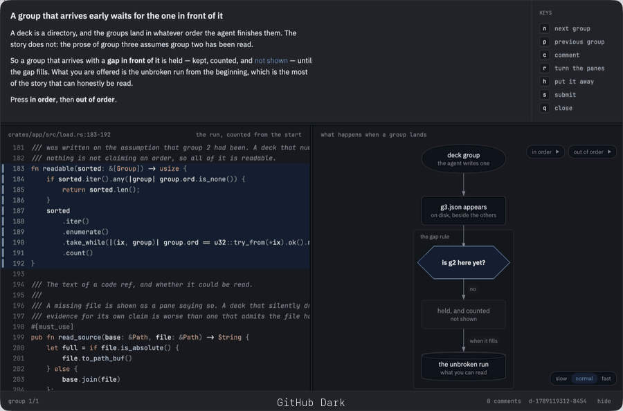

# Theming

Deck borrows your editor's colours rather than shipping a look you have to
tolerate beside your work.



<i>One deck, twenty themes, nothing changed but the config line. The page, the
text, the accent and the syntax come from the editor; the shapes and the spacing
are always deck's.</i>

```toml
# ~/.deck/config.toml
[theme]
editor = "vscode"   # nvim | zed | vscode | cursor | windsurf
```

It takes the page, the text, an accent, and whatever syntax colours the theme
has. Never its chrome — a theme designs its own status bar and tab strip, and
those are answers to questions deck is not asking. To try one on without changing
your editor:

```sh
deck open <path> --theme "vscode:Solarized Dark"
```

Light or dark follows the machine unless you say otherwise. Worth pinning for a
screenshot or a recording, which would otherwise change colour depending on what
time of day somebody plays it back:

```sh
deck open <path> --mode dark --paper warm
```

---

[← README](../README.md) · [The window](the-window.md) · [The walk](the-walk.md) · [Diagrams and pages](diagrams-and-pages.md) · [The catch](the-catch.md) · [How it works](how-it-works.md)
